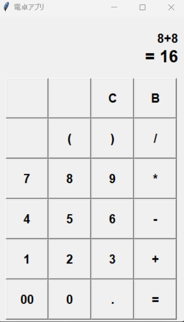
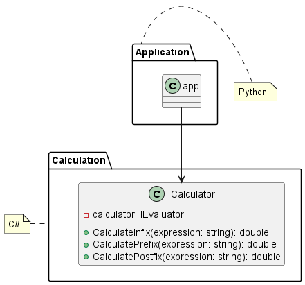

# Calculation-App

電卓 GUI アプリです。

## はじめに

これは計算モジュール https://github.com/desuboruto/Calculation-Module を使用した電卓 GUI アプリです。内部ロジックに関してはリンク先を見てください。
GUI には python の tkinter を用いています。

## 環境

-   python3
-   requestments.txt 要参照

## 電卓の仕様

-   繰り返し何度も計算ができる
-   小数点付きの数を使用できる
-   加減乗除が可能なこと
-   括弧をもちいた計算
-   バリデーション

## 使用方法

### 起動方法

アプリを実行する前に、必要な依存関係をインストールしてください。以下のコマンドを実行します。

```shell
pip install -r requirements.txt
```

依存関係をインストール後以下のコマンドを実行することでアプリを起動することができます。

```shell
python app.py
```

### 基本計算

通常の電卓と同様に計算することができます。
GUI に表示されるボタンをクリックして数値と演算子を入力し、計算式を作成します。計算を実行するには、イコール（=）ボタンをクリックしてください。



### 括弧を使用した計算

括弧を使用して、計算の優先順位を変更することができます。例えば、(1 + 2) \* 3 と入力すると、加算が先に行われ、その結果に 3 を乗算します。

### バリデーション

このアプリは以下のバリデーションを含んでいます：

-   0 での除算を防ぐ
-   小数点が複数含まれている数の使用を防ぐ
-   数値のみがオペランドとして受け入れられる
-   閉じられていない括弧の検出
-   オーバーフロー
-   不正な式の入力を防ぐ

これらのバリデーションは、ユーザーが計算式を入力し、`=`ボタンを押したときに実行されます。エラーが発生した場合は、適切なエラーメッセージが表示されます。

## クラス設計



## 参考資料

https://rightcode.co.jp/blog/become-engineer/python-tkinter-simple-calculator
